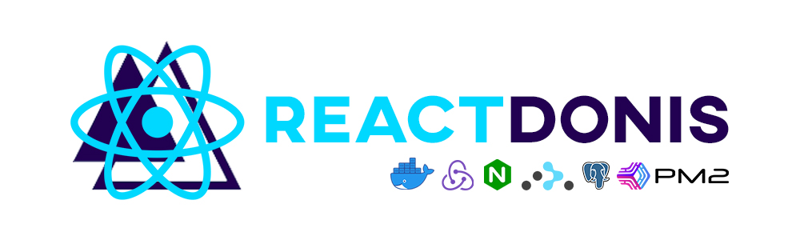

<p align="center">
  
</p>

<p align="center">
  <a href="https://pt-br.reactjs.org/"></a>
  <a href="https://redux.js.org/"></a>
  <a href="https://github.com/reduxjs/redux-thunk"></a>
  <a href="https://reacttraining.com/react-router/web/guides/quick-start"></a>
  <a href="https://pm2.keymetrics.io/"></a>
  <a href="https://nodejs.org/en/"></a>
  <a href="https://www.postgresql.org/"></a>
  <a href="https://adonisjs.com/"></a>
  <a href="https://www.npmjs.com/"></a>
  <a href="https://www.conventionalcommits.org/en/v1.0.0/"></a>
</p>

<hr>

## :bulb: Introduction 

A simple project starter with (Ngnix, Reactjs, Redux, Redux Thunk, React Router, AdonisJS, PostgreSQL, Docker, PM2) + (Conventional Changelog with Commitlint, Husky, Git CZ)

## :memo: Minimal Requirements

* NodeJs 12.x
* Docker 18.x
* Docker-compose 1.25.x

## 🚀 Install

```
$ https://github.com/gabriel-roque/react-donis-docker-starter
$ cd react-donis-docker-starter
```

## :wrench: Configure in development

```
$ ./entrypoint-dev.sh
```

## :wrench: Configure in production

```
$ ./entrypoint-prod.sh
```

## 📈 Run app

```
$ docker-compose up -d
```

> Check **web-app** in http://localhost:3000/  for _**DEVELOPMENT**_ 

> Check **web-app** in http://localhost/ for _**PRODUCTION**_

> Check **api** in http://localhost:8080

## 👤 Authors

| Gabriel Roque |
| ------------- |
|   |
| <a href="https://github.com/gabriel-roque">Github</a>  |
| <a href="https://www.linkedin.com/in/gabriel-roque/">Linkedin</a> |


## 🤝 Contributing

Contributions, issues and feature requests are welcome!<br />Feel free to check [issues page](https://github.com/gabriel-roque/react-donis-docker-starter/issues). 

## Show your support

Give a ⭐️ if this project helped you!
