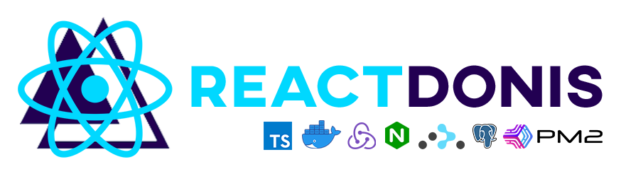

<p align="center">
  
</p>

<p align="center">
  <a href="https://app.netlify.com/sites/reactdonis/deploys"></a>
  <a href="https://pt-br.reactjs.org/"></a>
  <a href="https://redux.js.org/"></a>
  <a href="https://github.com/reduxjs/redux-thunk"></a>
  <a href="https://reacttraining.com/react-router/web/guides/quick-start"></a>
  <a href="https://pm2.keymetrics.io/"></a>
  <a href="https://nodejs.org/en/"></a>
  <a href="https://www.postgresql.org/"></a>
  <a href="https://adonisjs.com/"></a>
  <a href="https://www.npmjs.com/"></a>
  <a href="https://www.conventionalcommits.org/en/v1.0.0/"></a>
</p>

<hr>

## ⚓ Summary

- [Introduction](#introduction)
  - [Motivation](#motivation)
- [Minimal Requirements](#minimal-requirements)
- [Features](#features)
  - [Ngnix](#ngnix)
  - [PM2](#pm2)
  - [JWT](#jwt)
  - [Redux + Redux Thunk](#redux)
  - [React Router](#react-router)
  - [Commitlint](#commitlint)
- [Install](#install)
  - [Development](#development)
  - [Production](#production)
  - [Run App](#run-app)
- [Web-App](#run-app)
  - [Why Typescript](#why-typescript)
  - [File directory](#file-directory)
  - [Style Guide](#style-guide)
- [API](#api)
- [References](#references)

## 💡 Introduction

A starter project template with (Ngnix, ReactJS, Redux, Redux Thunk, React Router, AdonisJS, PostgreSQL, Docker, PM2) + (Conventional Changelog with Commitlint, Husky, Git CZ)

### 🏃 Motivation

🇺🇸 **EUA**

You may not want to set up a project from scratch, so decide to look for some base templete to design your system without having to deal with many configurations. So maybe ReactDonis is a good alternative for you and your team. The motivation is to share a pre-modeled structure where you can start your project in a few minutes and modify it according to the needs of your project.

ReactDonis does not seek to be a silver bullet (only solution) for all projects, but rather to provide an initial model for the construction of projects.

🇧🇷 **PT-BR**

Talvez você não queira configurar um projeto do zero, então resolve procurar algum templete base para projetar seu sistema sem ter que lidar com muitas configurações. Então talvez o ReactDonis seja uma boa alternativa para você e seu time. A motivação está em compartilhar uma estrutura pré modelada onde você pode começar seu projeto em poucos minutos e modificar conforme as necessidades do seu projeto.

O ReactDonis não procura ser uma bala de prata (única solucação) para todos os projetos e sim prover um modelos inicial para a construção de projetos.

## 🎉 Features

#### Ngnix

🇺🇸

Ngnix comes with a basic configuration, for more configurations just open the `default.conf` file in the `ngnix/config/default.conf` directory of this project. For more details on Ngnix settings access the documentation <a href="https://nginx.org/en/docs/" target="_blank">here</a>

🇧🇷

O Ngnix vem com uma configuração básica, para mais configurações basta abrir o arquivo `default.conf` no diretório `ngnix/config/default.conf` deste projeto. Para mais detalhes sobre configurações do Ngnix acesse a documenteção <a href="https://nginx.org/en/docs/" target="_blank">aqui</a>

**default.conf**

```
├── ngnix
│   └── config
│       └── default.conf
```

```
server {
  listen 80;
	index index.html;
	server_name localhost;
	error_log  /var/log/nginx/error.log;
	access_log /var/log/nginx/access.log;
	root /var/www/html;

  location / {
    try_files $uri /index.html =404;
  }
}
```

#### PM2

The use of PM2 is only used in **production configurations**. PM2 is an advanced manager for nodejs processes. You can learn more about PM2 and its features <a href="https://pm2.keymetrics.io/" target="_blank">here</a>

O uso do PM2 é somente utilizado em **configurações para produção**. O PM2 é um gerenciador avançado para processos nodejs. Você pode saber mais sobre o PM2 e suas funcionalidades <a href="https://pm2.keymetrics.io/" target="_blank">aqui</a>

#### JWT

#### Redux + Redux Thunk

#### React Router

#### Commitlint

## 📝 Minimal Requirements

- NodeJs 12.x
- Docker 18.x
- Docker-compose 1.25.x

## 🚀 Install

```
$ git clone https://github.com/gabriel-roque/react-donis-docker-starter
$ cd react-donis-docker-starter
```

### 🔧 Configure in development

```
$ ./entrypoint-dev.sh
```

### 🔧 Configure in production

```
$ ./entrypoint-prod.sh
```

## 📈 Run app

```
$ cd web-app && npm start
$ docker-compose up -d
```

[🔝 back to top](#summary)

> Check **web-app** in http://localhost:3000/ for _**DEVELOPMENT**_

> Check **web-app** in http://localhost/ for _**PRODUCTION**_

> Check **api** in http://localhost:8080

## 👤 Authors

| Gabriel Roque                                                                       |
| ----------------------------------------------------------------------------------- |
|  |
| <a href="https://github.com/gabriel-roque">Github</a>                               |
| <a href="https://www.linkedin.com/in/gabriel-roque/">Linkedin</a>                   |

## 🤝 Contributing

Contributions, issues and feature requests are welcome!<br />Feel free to check [issues page](https://github.com/gabriel-roque/react-donis-docker-starter/issues).

## Show your support

Give a ⭐️ if this project helped you!

<p align="center">
  
</p>

## ⛳ References

- **KISS (Keep it Simple and Stupid):** https://medium.com/@devisha.singh/the-kiss-principle-in-software-development-everything-you-need-to-know-dd8ea6e46bcd
- **NGNIX:** https://nginx.org/en/docs/

[🔝 back to top](#summary)
