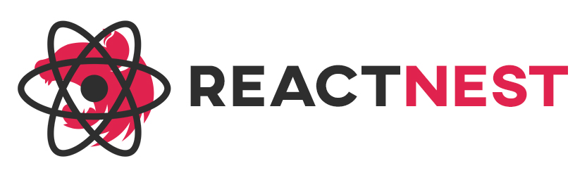
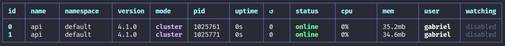
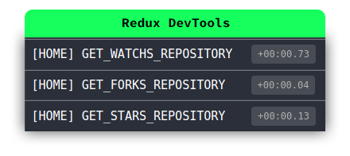
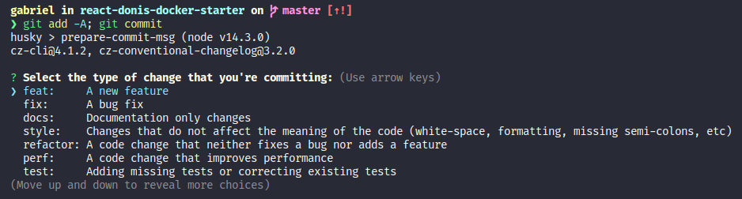
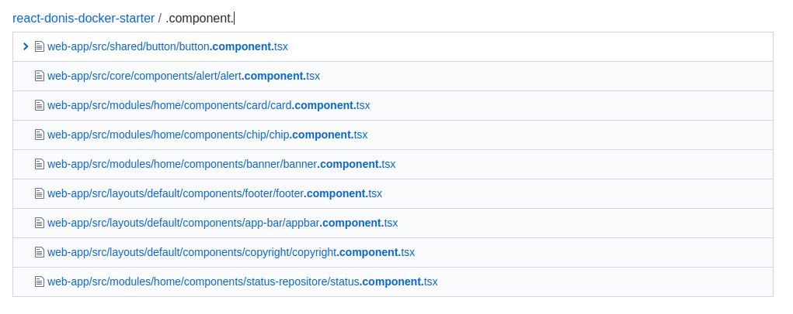
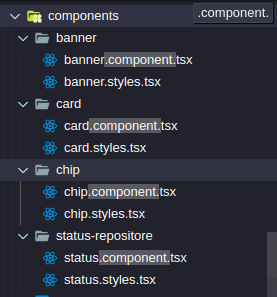
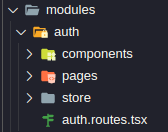
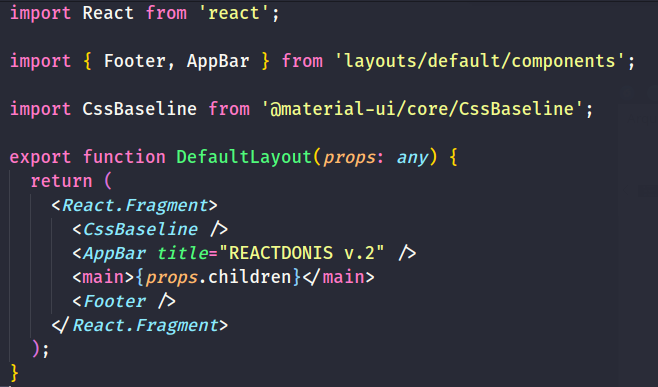
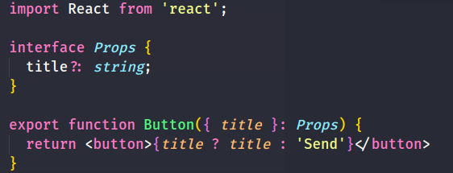
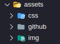

<p align="center">
  
</p>

<p align="center">
  <a href="https://app.netlify.com/sites/reactdonis/deploys"></a>
  <a href="https://pt-br.reactjs.org/"></a>
  <a href="https://redux.js.org/"></a>
  <a href="https://github.com/reduxjs/redux-thunk"></a>
  <a href="https://reacttraining.com/react-router/web/guides/quick-start"></a>
  <a href="https://pm2.keymetrics.io/"></a>
  <a href="https://nodejs.org/en/"></a>
  <a href="https://www.postgresql.org/"></a>
  <a href="https://nestjs.com/"></a>
  <a href="https://www.npmjs.com/"></a>
  <a href="https://www.conventionalcommits.org/en/v1.0.0/"></a>
</p>

<hr>

## ⚓ Summary

- [Introduction](#-introduction)
  - [Motivation](#-motivation)
- [Minimal Requirements](#-minimal-requirements)
- [Features](#-features)
  - [Ngnix](#ngnix)
  - [PM2](#pm2)
  - [React Router](#react-router)
  - [Redux + DevTools](#redux)
  - [Conventional Changelog](#conventional-changelog)
  - [TyprORM](#typeorm)
- [Install](#-install)
  - [Development](#-configure-in-development)
  - [Production](#-configure-in-production)
  - [Run App](#-run-app)
- [Web-App](#-web-app)
  - [Advantages](#advantages)
  - [Directory Structure](#directory-structure)
    - [Core](#core)
    - [Modules](#modules)
    - [Layouts](#layouts)
    - [Shared](#shared)
    - [Config](#config)
    - [Assets](#assets)
  - [Code Style](#code-style)
  - [Import Helpers](#import-group-helpers)
- [References](#-references)

## 💡 Introduction

🗼 A starter project template with (Ngnix, ReactJS, Redux, Redux Thunk, React Router, NestJS, TypeORM, PostgreSQL, Docker, PM2) + (Code Style, Conventional Changelog with Commitlint, Husky, Git CZ)

### 🏃 Motivation

🇺🇸 **EUA**

You may not want to set up a project from scratch, so you decide to look for some base templete to design your system, without having to deal with many configurations. So maybe Reactnest is a good alternative for you and your team. The motivation is to share a pre-modeled structure where you can start your project in a few minutes and modify it according to the needs of your project.

Reactnest does not seek to be a silver bullet (only solution) for all projects, but rather to provide an initial model for the construction of projects.

🇧🇷 **PT-BR**

Talvez você não queira configurar um projeto do zero, então você resolve procurar algum templete base para projetar seu sistema, sem ter que lidar com muitas configurações. Então talvez o Reactnest seja uma boa alternativa para você e seu time. A motivação está em compartilhar uma estrutura pré modelada onde você pode começar seu projeto em poucos minutos e modificar conforme as necessidades do seu projeto.

O Reactnest não procura ser uma bala de prata (única solução) para todos os projetos e sim prover um modelo inicial para a construção de projetos.

[🔝 back to top](#-summary)

## 🎉 Features

#### Ngnix

🇺🇸

Ngnix comes with a basic configuration, for more configurations just open the `default.conf` file in the `ngnix/config/default.conf` directory of this project. For more details on Ngnix settings access the documentation <a href="https://nginx.org/en/docs/" target="_blank">here</a>.

🇧🇷

O Ngnix vem com uma configuração básica, para mais configurações basta abrir o arquivo `default.conf` no diretório `ngnix/config/default.conf` deste projeto. Para mais detalhes sobre configurações do Ngnix acesse a documenteção <a href="https://nginx.org/en/docs/" target="_blank">aqui</a>.

**default.conf**

```
├── ngnix
│   └── config
│       └── default.conf
```

```
server {
  listen 80;
	index index.html;
	server_name localhost;
	error_log  /var/log/nginx/error.log;
	access_log /var/log/nginx/access.log;
	root /var/www/html;

  location / {
    try_files $uri /index.html =404;
  }
}
```

[🔝 back to top](#-summary)

#### PM2

🇺🇸

The use of PM2 is only used in **production configurations**. PM2 is an advanced manager for NodeJS processes. You can learn more about PM2 and its features <a href="https://pm2.keymetrics.io/" target="_blank">here</a> The PM2 configuration file can be found at `api/ecosystem.config.js`

🇧🇷

O uso do PM2 é somente utilizado em **configurações para produção**. O PM2 é um gerenciador avançado para processos NodeJS. Você pode saber mais sobre o PM2 e suas funcionalidades <a href="https://pm2.keymetrics.io/" target="_blank">aqui</a>. O arquivo de configuração do PM2 se encontra em `api/ecosystem.config.js`

**ecosystem.config.js**

```js
module.exports = {
  apps: [
    {
      name: 'api',
      script: 'server.js',

      instances: 2,
      autorestart: true,
      watch: false,
      max_memory_restart: '1G',
      env: {
        NODE_ENV: 'development',
      },
      env_production: {
        NODE_ENV: 'production',
      },
    },
  ],
};
```

🇺🇸

When running in production you will get a result similar to 2 instances of the API managed by PM2. Through the `npx pm2 monit` command, the PM2 monitored over the API will be displayed on your terminal.

🇧🇷

Ao executar em produção você terá um resultado semelhante a 2 instâncias da API gerenciada pelo PM2. Através do comando `npx pm2 monit` será exibido em seu terminal o monitorado do PM2 sobre a API.

<p align="center">
  
</p>

[🔝 back to top](#-summary)

#### Redux

🇺🇸

With Redux DevTools we can easily find the events for each action as defined by [code style](#code-style). If you do not already have the extension in your browser, access [here](https://github.com/reduxjs/redux-devtools).

🇧🇷

Com o Redux DevTools podemos com facilidade encontrar os eventos de cada action conforme definido pelo [code style](#code-style). Caso ainda não possua a extensão no seu navagador acesse [aqui](https://github.com/reduxjs/redux-devtools).

<p align="center">
  
</p>

[🔝 back to top](#-summary)

#### React Router

🇺🇸

To simplify route management, each module has a route file
which you are responsible for grouping and organizing. In this boilerplate, the route file has a property called **public** that aims to point out whether it is a public or private route. It is up to you to implement the best route security strategy.

🇧🇷

Para simplificar o gerenciamento de rotas, cada módulo possui um arquivo de rotas
do qual é responsável de agrupar e organizar. Neste boilerplate o arquivo de rotas possui a uma propriedade chamada de **public** que tem como o propósito apontar se é uma rota pública ou privada. Fica a seu critério implementar a melhor estratégia de segurança de rotas.

```ts
export const routesHome = [
  {
    path: '/',
    component: HomePage,
    name: 'home.home',
    public: true,
  },
];
```

[🔝 back to top](#-summary)

#### Conventional Changelog

🇺🇸

This project has tools that apply the standards provided for in **RFC 2119** for code change message standardization conventions. To learn more about the tools, we recommend accessing their own documentation.

🇧🇷

Este projeto possui ferramentas que aplicam as normas previstas na **RFC 2119** pra convenções de padronização de mensagens de alteração de código. Para saber mais sobre as ferramentas recomendamos acessar sua própria documentação.

<p align="center">
  
  
</p>

| Tools & RFC                                                              |
| ------------------------------------------------------------------------ |
| [Commitlint](https://github.com/conventional-changelog/commitlint)       |
| [Husky](https://github.com/typicode/husky)                               |
| [Git CZ](https://github.com/commitizen/cz-cli)                           |
| [RFC 2119](https://www.ietf.org/rfc/rfc2119.txt)                         |
| [Conventional Changelog](https://www.conventionalcommits.org/en/v1.0.0/) |

[🔝 back to top](#-summary)

### TypeORM

```sh
// create migration blank
$ npm run typeorm:create

// create migration by modify entity
$ npm run typeorm:migrate

// run migrations
$ npm run typeorm:run

// revert migrations
$ typeorm:revert

// drop migrations database
$ typeorm:drop

// create an entity
$ entity:create
```

[🔝 back to top](#-summary)

## 📝 Minimal Requirements

- NodeJs 14.x
- Docker 18.x
- Docker-compose 1.25.x

## 🚀 Install

```

$ git clone https://github.com/gabriel-roque/react-donis-docker-starter
$ cd react-donis-docker-starter

```

### 🔧 Configure in development

```

$ ./entrypoint-dev.sh

```

### 🔧 Configure in production

```

$ ./entrypoint-prod.sh

```

## 📈 Run app

```

$ cd web-app && npm start
$ cd api && npm run start:dev
// or
$ docker-compose up -d

```

> Check **web-app** in http://localhost:3000

> Check **api** in http://localhost:8080

[🔝 back to top](#-summary)

## 🖥️ Web-App

### Advantages

🇺🇸

It should be noted that the advantages here highlighted are not all, but the main ones that can change the way you build your applications. Any and all functionality present in templete is completely modifiable to suit the needs of your project if you need it.

🇧🇷

Cabe ressaltar que as vantagens aqui destacas não são todas, mas sim as principais que podem mudar a forma como você constroe suas aplicações. Toda e qualquer funcionalidade presente sente templete é completamente modificável para adequar as necessidades de seu projeto caso necessite.

**1. Easy search | Busca fácil**

🇺🇸

Easily find any part of your application in your project using the naming pattern, for more advantages of this approach see **code style** [angular](https://angular.io/guide/styleguide).

This approach allows easy search and integration with search engines, whether from your IDEA or from a repository such as GitHub.

🇧🇷

Encontre facilmente qualquer parte da sua aplicação em seu projeto com o uso de padrão de nomeação, para mais vantagens dessa abordagem consulte o **code style** [angular](https://angular.io/guide/styleguide).

Essa abordagem permite uma fácil busca e integração com buscadores sejam de sua IDEA ou de repositório como o GitHub.


<p align="center">
  
<p>

**2. Opined and defined | Opinado e definido**

🇺🇸

As well as frameworks like **Laravel**, **Rails** or **AdonisJS** itself have **Design Patterns** and architectural structures in common and well thought out. In this way **Reactnest** seeks to bring a construction of a base structure so that you can develop your projects without having to decide many things (opinionated), but also not taking away its power of architectural changes, technologies and etc.

That is, Reactnest defines a guide for your project, but nothing will stop you from making your changes, feel free to contribute.

🇧🇷

Assim como frameworks como **Laravel**, **Rails** ou o próprio **AdonisJS** possuem **Design Patterns** e estruturas arquiteturais em comum e bem opnidas. Desta forma o **Reactnest** procura trazer uma construção de uma estrurura base que você possa desenvolver seus projetos sem ter que dicidir muitas coisas (opinada), mas também não tirando seu poder de alterações arquiteturais, tecnologias e etc.

Isto é, o Reactnest define um guia para o seu projeto, porém nada o impedirá de fazer suas modificações, fique a vontade para contribuir.

**3. Based on Conventions and Styles Popular Guides | Baseado em Convenções e Styles Guides Populares**

🇺🇸

In such a vast universe of technologies, there are norms and standards for almost everything. In this way, some code standards were also adopted or commonly known as Style Guides or Codes Style. The Style guide used for the front-end was based on the [JavaScript Standard Style](https://standardjs.com/) and the [Fuse](http://fusetheme.com/) for **React and Angular**.

If you want to adopt another Style Guide, feel free to define one that meets the needs of your project.

🇧🇷

Em um universo tão vasto de tecnologias, existem normas e padrões para quase tudo. Desta forma também foi adotado alguns padrões de código ou porpulamente conhecido como Style Guides ou Codes Style. O Style guide utilizado para a front-end foi baseado no [JavaScript Standard Style](https://standardjs.com/) e no templete [Fuse](http://fusetheme.com/) para **React e Angular**.

Se você desejar adotar outro Style Guide fique completamente a vontade para definir um que se atenda as necessidade do seu projeto.

[🔝 back to top](#-summary)

<hr>

### Directory Structure

#### Core

🇺🇸

The **core** module should contain only parts of your application that **have no** relationship to **business rule**. It should also be allocated to the core **providers or singleton instances**, that is, they will only have a single instance in the entire application.

_How to define?_

**Question**: How do I know what to put on the core module and what not?

**Answer**: Simple, ask yourself the following question. If I put this here can I use it in another project easily without many complications and without containing any business rules?

If so, this part of the application can be easily maintained in the core, if the answer is no, it should be attached to the module that the business rule corresponds to.

You can see through the examples below, that in all cases the parts that are allocated within the core module fit within the question. Like **useful components, providers and function**.

🇧🇷

O môdulo **core** deve conter somente partes da sua aplicação que **não possuem nenhuma** relação com **regra de negócio**. Também deve ser alocado ao core **provedores ou instâncias singleton**, isto é que só terão apenas uma única instância em toda a aplicação.

_Como definir?_

**Pergunta**: Como saber o que devo colocar ou não no môdulo core?

**Resposta**: Simples, se faça a seguinte pergunta. Se eu colocar isso aqui eu posso usar em outro projeto facilmente sem muitas complicações e sem conter alguma regra de négocio?

Se sim, esta parte da aplicação pode ser matinda facilmente na core, caso a resposta seja não ela deverá ficar juntamente ao môdulo que a regra de negócio corresponde.

Você pode percebe através dos exemplos abaixo, que em todos os casos as partes que estão alocadas dentro do módulo core se encaixam dentro da pergunta. Como **componentes, provedores e função úteis**.

<p align="center">
  
</p>

[🔝 back to top](#-summary)

<hr>

#### Modules

🇺🇸

It represents a use case for your application and explicitly a functional requirement. For example a Product CRUD. Certainly what is inside the module directory has a business rule included. It contains the following directories:

- **components**: it must be allocated all the components belonging to the module;
- **pages**: you must add all the pages that refer to this module;
- **store**: must maintain the global status management files of the module provided for in
  <a href="https://scotch.io/tutorials/getting-to-know-flux-the-react-js-architecture" target="_blank">
  flux architecture;
  </a>
- **auth.routes.tsx**: it should be declared all the routes of this module.

🇧🇷

Representa um caso de uso da sua aplicação e esplicitamente um requisito funcional. Por exemplo, um CRUD de Produtos. Certamente o que está dentro do diretório de modulos possui uma regra de negócio inclusa. Ela contem os seguintes diretórios:

- **components**: nela deverá ser alocados todos os componentes pertencentes ao módulo;
- **pages**: deverá agregar todas as páginas que remetem a este módulo;
- **store**: deve manter os arquivos de gerecimento de estado global do módulo prevista na
  <a href="https://scotch.io/tutorials/getting-to-know-flux-the-react-js-architecture" target="_blank">
  arquitetura flux;
  </a>
- **auth.routes.tsx**: nele deverá ser declarados todas as rotas deste módulo;

**Modules Directory Structure**

<p align="center">
  
</p>

[🔝 back to top](#-summary)

<hr>

#### Layouts

🇺🇸

Certainly your application will need layouts for greater code segregation. In the `layouts` directory you can find the following structure:

- **default**: represents a folder with everything that belongs to the layout;
- **components**: it must be allocated only the components necessary for the implementation of the layout;
- **default.layout.tsx**: represents the final layout file;

🇧🇷

Certamente sua aplicação precisará de layouts para maior segregação de código. No diretório `layouts` é possível encontrar a seguinte estrutura:

- **default**: representa uma pasta com tudo que pertence ao layout;
- **components**: nela deve ser alocado somente os componentes necessários para a implementação do layout;
- **default.layout.tsx**: representa o arquivo final do layout;

**Layouts Directory Structure**

<p align="center">
  
</p>

[🔝 back to top](#-summary)

<hr>

#### Shared

🇺🇸

In this directory, all components must be allocated where:

- Do not have a business rule;
- They can have more than one instance;
- And can be shared only between modules.

For example a button or an input with an error message included.

🇧🇷

Neste diretório deverá ser alocados todos os componentes onde:

- Não possuam regra de negócio;
- Podem ter mais de uma instância;
- E podem ser compartilhados somente entre os módulos.

Por exemplo um botão ou um input com mensagem de erro inclusa.

<p align="center">
  
</p>

[🔝 back to top](#-summary)

<hr>

#### Config

🇺🇸

Directory responsible for centralizing all application settings such as **navigation, status generation, routes, internal services** and **themes**.

A good example of what should be allocated in `services` are internal services like the API (back-end) and payment gateway integration services like <a href ="https://stripe.com/en-br" target="blank"> Stripe. </a>

Another good example of what should be allocated in `theme` are everything that is directly linked to **application design**, such as **color palette, fonts** and etc.

For more details of the implemented settings click below:

- **Navigation and Routes** [React Router](#react-router)
- **Managing state** [(Redux + DevTools)](#redux)

🇧🇷

Diretório responsável por centralizar todas configurações da aplicação tais como **navegação, geracimento de estado, rotas, serviços internos** e **temas**.

Um bom exemplo do que deve ser alocado em `services` são serviços internos como a API (back-end) e serviços de integração de gateway de pagamento como a <a href="https://stripe.com/en-br" target="blank">Stripe</a>.

Um outro bom exemplo do que deverá ser alocado em `theme` são tudo que está diretamente ligado ao **design da aplicação**, como **paleta de cores, fontes** e etc.

Para mais detalhes das configurações implementadas clique a baixo:

- **Navegação e Rotas** [React Router](#react-router)
- **Gereciando de estado** [(Redux + DevTools)](#redux)

<p align="center">
  
</p>

[🔝 back to top](#-summary)

<hr>

#### Assets

🇺🇸

In these directorie are all the static files that will be used in the application (front-end) such as **css, images, gifs, media, fonts** and etc.

🇧🇷

Neste diretório encontra-se todos os arquivos estáticos que serão utilizados na aplicação (front-end) tais como **css, images, gifs, mídias, fontes** e etc.

<p align="center">
  
</p>

[🔝 back to top](#-summary)

<hr>

## Code Style

#### How to name Component

| Name File              | Symbol Name                                |
| ---------------------- | ------------------------------------------ |
| dot.case               | CamelCase                                  |
| `<name>.component.tsx` | `export default function <Name>() { ... }` |

```ts
  export default function BannerParalax() {
    return (...)
  }
```

#### How to name Page Component

| Name File         | Symbol Name                              |
| ----------------- | ---------------------------------------- |
| dot.case          | CamelCase + Page                         |
| `<name>.page.tsx` | `export function <NamePage()>() { ... }` |

```ts
  export function LoginPage() {
    return (...)
  }
```

#### How to name Layouts

| Name File           | Symbol Name                                        |
| ------------------- | -------------------------------------------------- |
| dot.case            | CamelCase + Layout                                 |
| `<name>.layout.tsx` | `export default function <NameLayout()>() { ... }` |

**default.layout.tsx**

```js
import React from 'react';

import { Footer, AppBar } from 'layouts/default/components';

export function DefaultLayout(props: any) {
  return (
    <React.Fragment>
      <AppBar title="REACTNEST V.3" />
      <main>{props.children}</main>
      <Footer />
    </React.Fragment>
  );
}
```

Using layout in **home.page.tsx**

```js
import React from 'react';

import { DefaultLayout } from 'layouts';

export default function HomePage() {
  return (
    <DefaultLayout>
      <div>...</div>
    </DefaultLayout>
  );
}
```

#### How to name styles

| Name File           | Symbol Name                                                |
| ------------------- | ---------------------------------------------------------- |
| dot.case            | CamelCase + Page                                           |
| `<name>.styles.tsx` | `export const useStyles = makeStyles(theme => ({ ... }));` |

```ts
import { makeStyles } from '@material-ui/core/styles';

export const useStyles = makeStyles(theme => ({
  ...
}));
```

#### How to name Routes

| Name File                  | Symbol Name                               |
| -------------------------- | ----------------------------------------- |
| dot.case                   | routes + CamelCase                        |
| `<name module>.routes.tsx` | `export const routes<NameModule> = [...]` |

| path          | component             | name                             | public                     |
| ------------- | --------------------- | -------------------------------- | -------------------------- |
| Path fo Route | Component will Render | `<name module>.<name-component>` | Is route public or private |

```ts
import { lazy } from 'react';

const LoginPage = lazy(() => import('modules/auth/pages/login/login.page'));

export const routesAuth = [
  {
    path: '/login',
    component: LoginPage,
    name: 'auth.login',
    public: false,
  },
];
```

#### How to name mocks

| Name File               |
| ----------------------- |
| dot.case                |
| `<name module>.mock.ts` |
| **cards.mocks.ts**      |

#### How to name files redux store

| Actions/Dispatchs        | Reducers                 | State Module            | Types                  |
| ------------------------ | ------------------------ | ----------------------- | ---------------------- |
| CamelCase                | `case types.<NAME_TYPE>` | `INITIAL_STATE = {...}` | UPPER_CASE             |
| <name_module>.actions.ts | <name_module>.reducer.ts | <name_module>.state.ts  | <name_module>.types.ts |

**<name_module>.actions.ts**

```ts
import * as types from './types';

export const setData = (data) => {
  return (dispatch) => {
    dispatch({ types: types.SET_DATA_EXAMPLE, data });
  };
};
```

**<name_module>.reducer.ts**

```ts
import { INITIAL_STATE } from './state';
import * as types from './types';

export default (state = INITIAL_STATE, action) => {
  switch (action.type) {
    case types.SET_DATA_EXAMPLE:
      return { ...state, ...action.data };
    default:
      return state;
  }
};
```

**<name_module>.state.ts**

```ts
export const INITIAL_STATE = {
  data: 'example data share in redux',
};
```

**<name_module>.types.ts**

```ts
export const SET_DATA_EXAMPLE = '[<NAME_MODULE>] SET_DATA_EXAMPLE';
```

### Import Helpers

🇺🇸

In order to keep imports within our React components organized, we use a library called **Import Helpers**, it helps us to self-organize imports. Being completely customizable.

To understand more of the advantages of this code style click [here](#advantages).

🇧🇷

A fim de manter organizado as importações dentro de nossos componentes React, usamos uma biblioteca chamada de **Import Helpers**, ele nos auxilia a auto organizar as importações. Sendo completamente customizável.

Para entender mais das vantagens desse code style clique [aqui](#advantages).

[🔝 back to top](#-summary)

<hr>

## 👤 Authors

<p align="center">
  <a href="https://www.linkedin.com/in/gabriel-roque/">
    
  </a>
  <a href="https://github.com/gabriel-roque">
    
  </a>
</p>

## 🤝 Contributing

Contributions, issues and feature requests are welcome!<br />Feel free to check [issues page](https://github.com/gabriel-roque/react-donis-docker-starter/issues).

## Show your support

Give a ⭐️ if this project helped you!

<p align="center">
  
</p>

## ⛳ References

[KISS (Keep it Simple and Stupid)](https://medium.com/@devisha.singh/the-kiss-principle-in-software-development-everything-you-need-to-know-dd8ea6e46bcd) |
[NGNIX](https://nginx.org/en/docs/) |
[Commitlint](https://github.com/conventional-changelog/commitlint) |
[Husky](https://github.com/typicode/husky) |
[Git CZ](https://github.com/commitizen/cz-cli) |
[RFC 2119](https://www.ietf.org/rfc/rfc2119.txt) |
[Conventional Changelog](https://www.conventionalcommits.org/en/v1.0.0/) |
[Flux Architecture](https://scotch.io/tutorials/getting-to-know-flux-the-react-js-architecture) |
[Style Guides](https://standardjs.com/) |

[🔝 back to top](#-summary)
